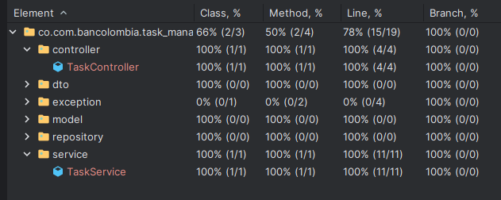
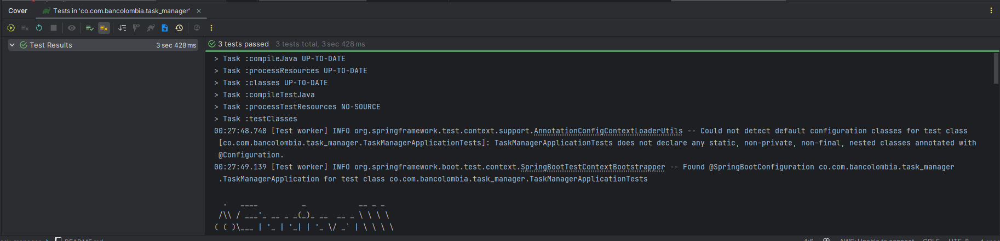
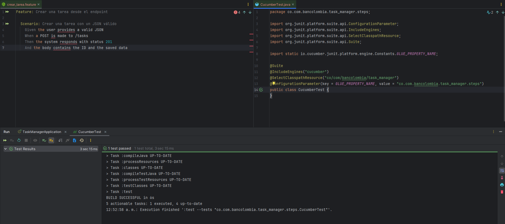

## 1. Evidencia de paso de las pruebas unitarias
### imagen de la ejecución de las pruebas unitarias y su resultado.
#### 
#### 

## 2. Curl petición para crear una tarea
```bash
curl --location 'http://localhost:3000/api/v1/tasks' \
--header 'Content-Type: application/json' \
--data '{
    "name": "Dormir temparano",
    "description": "Para salir a la calle a las 3pm"
}'
```

```text
Escenario: Crear una tarea desde el endpoint
Dado que el usuario proporciona un JSON válido
Cuando se hace un POST a /tasks
Entonces el sistema responde con estado 201
Y el cuerpo contiene el ID y los datos guardados
```
## Imagen de escenario de prueba
#### 